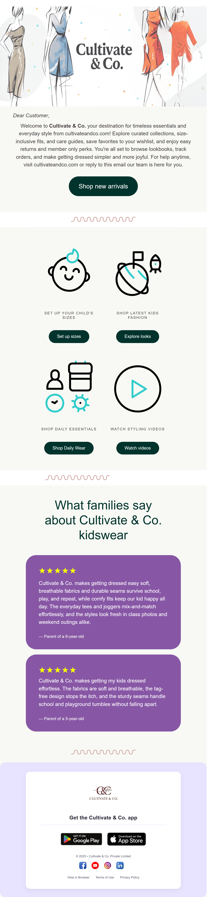

# Fashion Email Template

A concise, responsive HTML email template for fashion brand campaigns.

## Features
- Table-based layout with inline styles for robust client support
- Mobile-friendly width, readable typography, and a clear CTA button
- Hero banner, greeting copy, and central call‑to‑action
- Social icon placeholders ready to link your channels

## Quick Start
- Open `index.html` locally or paste its HTML into your ESP (Mailchimp, Klaviyo, SendGrid)
- Replace brand copy, URLs, and button text to match your campaign
- Swap images in `images/` and keep file sizes modest (<200KB preferred)
- Send test emails to Gmail, Outlook, and Apple Mail before launching

## Customize
- Update colors and fonts directly in `index.html` to fit your brand
- Edit text blocks to highlight promotions or new arrivals
- Replace social icons and link them to your profiles

## Structure
- `index.html` — email markup
- `images/` — assets used by the template

## Compatibility
- Works in Gmail, Outlook (modern versions), Apple Mail, Yahoo
- Uses safe HTML/CSS for email clients; avoids unsupported features
